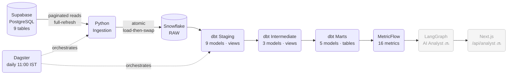
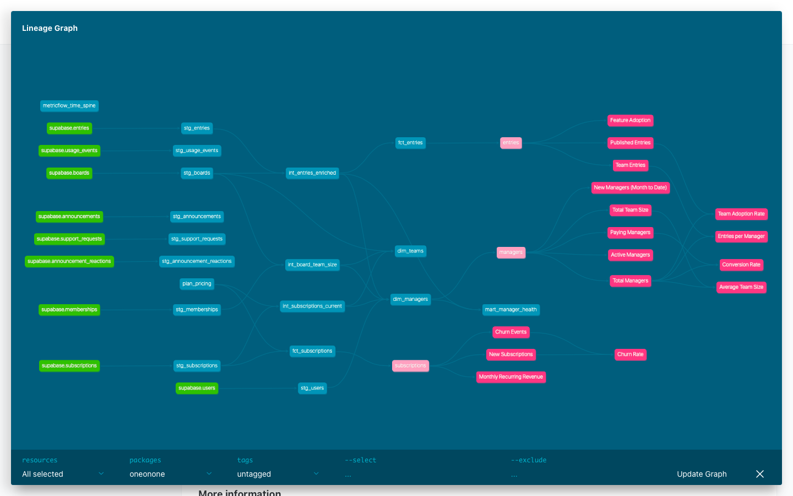

# OneOnOne Analytics Pipeline

> Production-grade data pipeline on a live SaaS product — from Supabase to Snowflake, dbt, MetricFlow, and a LangGraph AI analyst.

Built on top of [OneOnOne](https://github.com/whysokara/oneonone) — a shared work journal for managers and their teams. Not a tutorial dataset. Real users, real subscriptions, real MRR.


**9 source tables · 17 dbt models · 80+ tests · 16 MetricFlow metrics · $85.83 live MRR · daily Dagster pipeline**

---

## Architecture



## Data Lineage

Model-level DAG from source tables through staging → intermediate → marts, generated by `dbt docs`:



> **To view locally:** `cd transform && dbt docs generate && dbt docs serve` — opens at `http://localhost:8080`

---

## What's Shipped

| Layer | Status | Detail |
|---|---|---|
| Python ingestion | ✅ Shipped | Paginated reads, atomic load-then-swap, 9 tables |
| Snowflake RBAC | ✅ Shipped | LOADER + TRANSFORMER least-privilege roles |
| dbt staging | ✅ Shipped | 9 models, camelCase → snake_case, TIMESTAMP_TZ |
| dbt intermediate | ✅ Shipped | 3 views — team size, enriched entries, current subscription |
| dbt marts | ✅ Shipped | 5 tables, 80+ tests, `plan_pricing` seed |
| MetricFlow semantic layer | ✅ Shipped | 3 semantic models, 16 metrics, 4018-day time spine |
| Dagster orchestration | ✅ Shipped | Asset graph, daily schedule, dbt tests as asset checks |
| LangGraph AI analyst | 🔜 Week 5 | 4 tools, per-manager scoping |
| 20-question eval set | 🔜 Week 6 | Confidence handling, sanity checks |
| In-app chat | 🔜 Week 7 | Next.js `/api/analyst`, manager-scoped answers |

---

## Stack

| Layer | Tool | Purpose |
|---|---|---|
| Source | Supabase (PostgreSQL) | Live production data, 9 tables, service-role auth |
| Ingestion | Python · `supabase-py` · `snowflake-connector` | Paginated reads, atomic Snowflake loads |
| Orchestration | Dagster | Asset graph, lineage UI, daily cron at 11:00 IST |
| Warehouse | Snowflake | RAW / STAGING / MARTS schemas, RBAC |
| Transformation | dbt Core | Staging → intermediate → marts, 80+ tests |
| Semantic layer | MetricFlow | 3 semantic models, 16 business metrics |
| AI Agent *(planned)* | LangGraph | 4 tools, answers scoped per manager |
| In-app chat *(planned)* | Next.js | `/api/analyst` route inside OneOnOne |

---

## Data Models

### Staging — 9 views (1:1 with source tables)
| Model | Source Table | Key transformations |
|---|---|---|
| `stg_users` | `users` | camelCase → snake_case, cast to TIMESTAMP_TZ |
| `stg_boards` | `boards` | camelCase → snake_case |
| `stg_memberships` | `memberships` | full-refresh |
| `stg_entries` | `entries` | camelCase → snake_case, entry lifecycle status |
| `stg_subscriptions` | `subscriptions` | snake_case, plan / billing_cycle / status |
| `stg_announcements` | `announcements` | camelCase → snake_case |
| `stg_announcement_reactions` | `announcement_reactions` | full-refresh |
| `stg_usage_events` | `usage_events` | append-only |
| `stg_support_requests` | `support_requests` | full-refresh |

### Intermediate — 3 views (reusable joins, no business logic in staging)
| Model | Grain | Purpose |
|---|---|---|
| `int_entries_enriched` | one row per entry | Adds `is_self_entry`, `is_first_entry` flags |
| `int_board_team_size` | one row per board | Member count excluding the manager |
| `int_subscriptions_current` | one row per user | Joins `plan_pricing` seed, normalizes MRR, sets `is_paying` |

### Marts — 5 tables (business logic, tested, materialized)
| Model | Grain | Purpose |
|---|---|---|
| `dim_managers` | one row per manager | Plan, team size, activation status, MRR contribution |
| `dim_teams` | one row per board | Team size, manager plan, creation date |
| `fct_entries` | one row per entry | Category, status, `is_self_entry`, `is_first_entry` |
| `fct_subscriptions` | one row per subscription event | MRR amount, transition type (new / upgrade / churn) |
| `mart_manager_health` | one row per manager | Churn signal: entry frequency + last activity + plan |

---

## MetricFlow Metrics

16 metrics across 3 semantic models, queryable via `mf query`.

**Managers** (`sem_managers` → `dim_managers`)
| Metric | Label | Description |
|---|---|---|
| `total_managers` | Total Managers | All manager accounts ever created |
| `new_managers_mtd` | New Managers MTD | Cumulative sign-ups in the current calendar month |
| `active_managers` | Active Managers | Managers with at least one published team entry |
| `paying_managers` | Paying Managers | Managers on an active, non-complimentary paid plan |
| `avg_team_size` | Average Team Size | Derived: total team members ÷ total managers |
| `conversion_rate` | Conversion Rate | Ratio: paying managers ÷ total managers |
| `total_team_size_metric` | Total Team Size | Sum of team sizes (numerator for avg_team_size) |

**Entries** (`sem_entries` → `fct_entries`)
| Metric | Label | Description |
|---|---|---|
| `team_entries` | Team Entries | All team entries, excluding manager self-entries |
| `published_entries` | Published Entries | Published team entries (excludes drafts + self-entries) |
| `entries_per_manager` | Entries per Manager | Derived cross-model: team entries ÷ total managers |
| `team_adoption_rate` | Team Adoption Rate | Published entries per manager — directional adoption signal |
| `feature_adoption` | Feature Adoption | Employees who logged their first published entry |

**Subscriptions** (`sem_subscriptions` → `fct_subscriptions`)
| Metric | Label | Description |
|---|---|---|
| `mrr` | Monthly Recurring Revenue | Active, non-complimentary subs; annual normalized to `annual_price / 12` |
| `new_subscriptions` | New Subscriptions | New subscription sign-up events |
| `churn_rate` | Churn Rate | Ratio: churn events ÷ new subscriptions |
| `churn_count_metric` | Churn Events | Raw count of churn transition events |

```bash
# Sample queries
DBT_PROFILES_DIR=~/.dbt mf query --metrics mrr --group-by metric_time__month
DBT_PROFILES_DIR=~/.dbt mf query --metrics active_managers --group-by metric_time__week
DBT_PROFILES_DIR=~/.dbt mf query --metrics conversion_rate,total_managers
```

---

## Business Rules in the Pipeline

These are product decisions encoded as data constraints — they exist because the pipeline author built OneOnOne and knows why each rule matters:

- **Manager self-entries excluded** — when `employeeId = managerId`, the entry is the manager logging their own work. Excluded from all team metrics (`is_self_entry = false` filter), included in volume totals.
- **MRR filter** — only `status = 'active'` AND `is_complimentary = false`. Free plan = $0. Complimentary grants = $0. Both columns checked.
- **Annual MRR normalization** — `annual_price / 12`, not `monthly_price × 12`. Annual plans include 2 free months, so these are different numbers.
- **Activation definition** — a manager is activated when at least one *team member* (not the manager) has a published entry. Board created ≠ activated.
- **Financial year** — April–March (Q1 = Apr–Jun). Used for all business metrics. Usage quota tracking uses calendar quarters — never mixed.

---

## Engineering Decisions Worth Noting

**Atomic ingestion** — raw tables are loaded into `_STAGING` tables first, then renamed in a transaction. dbt never sees a half-loaded RAW table.

**Pagination that caught 46% data loss** — `entries` had 1,863 rows but Supabase's default cap silently returned 1,000. Caught with an independent `count='exact'` check. Fixed with a `.range()` loop. Every other project that skips this has silent data loss.

**Semantic layer before AI agent** — MetricFlow was built in Week 4; the LangGraph agent (Week 5) calls `mf query` under the hood. Metrics need a trusted, versioned definition before an LLM can cite them. Most "AI on data" demos skip this step.

**Snowflake RBAC validation** — discovered that `DEFAULT_SECONDARY_ROLES = ('ALL')` means `USE ROLE X` doesn't actually isolate one role's privileges. Used `USE SECONDARY ROLES NONE` to validate the LOADER/TRANSFORMER separation was correct.

**Dagster asset checks** — dbt tests surface as Dagster asset checks, not just CI output. A failing `unique` test on `fct_entries` shows in the lineage view next to the mart it guards — different debugging experience from reading a log.

---

## Setup

```bash
python3 -m venv .venv && source .venv/bin/activate
pip install -r requirements.txt
cp .env.example .env   # fill in Supabase + Snowflake credentials
```

### Environment Variables

```bash
SUPABASE_URL=https://<project>.supabase.co
SUPABASE_SERVICE_ROLE_KEY=...       # always service-role, never anon key
SNOWFLAKE_ACCOUNT=<org>-<account>
SNOWFLAKE_USER=...
SNOWFLAKE_PASSWORD=...
SNOWFLAKE_WAREHOUSE=ONEONONE_WH
SNOWFLAKE_DATABASE=ONEONONE_DB
SNOWFLAKE_SCHEMA=RAW
```

### Running the Pipeline

```bash
# Full pipeline via Dagster (recommended)
.venv/bin/dagster dev -f orchestration/definitions.py          # UI at localhost:3000
.venv/bin/dagster job execute -f orchestration/definitions.py -j daily_pipeline

# After editing dbt models, refresh Dagster's asset graph:
cd transform && dbt parse

# Run individual steps directly
python ingestion/seed_data.py     # append seed rows to Supabase
python ingestion/ingest.py        # Supabase → Snowflake RAW
dbt build                         # run all models + tests
dbt build --select marts.*        # marts only

# MetricFlow (run from repo root; health-check must be run from transform/)
DBT_PROFILES_DIR=~/.dbt mf query --metrics mrr --group-by metric_time__month
cd transform && DBT_PROFILES_DIR=~/.dbt mf health-checks
```

> If you use pyenv, prefer `.venv/bin/dagster` (explicit path) — pyenv shims can shadow the venv's `dagster` even when the venv is active.

---

## Project Structure

```
ingestion/              # Python: Supabase → Snowflake (ingest, seed_data, db)
transform/              # dbt project root
  models/
    staging/            # stg_* — typed, renamed, no business logic
    intermediate/       # int_* — reusable joins shared across marts
    marts/              # dim_*, fct_*, mart_* — business logic, materialized as tables
    metrics/            # MetricFlow semantic models + metric definitions
  seeds/                # plan_pricing.csv — real prices from the landing page
  macros/               # generate_schema_name + reusable Jinja
orchestration/          # Dagster: assets, daily_pipeline job, 11:00 IST schedule
snowflake/              # setup.sql / teardown.sql — warehouse, DB, schemas, RBAC
assets/                 # screenshots and diagrams
my docs/                # ISSUES_LOG.md — 11 bugs documented with root cause + fix
```

---

## Related

- **OneOnOne (the product):** [github.com/whysokara/oneonone](https://github.com/whysokara/oneonone) — the Next.js SaaS this pipeline runs on top of
- **ISSUES_LOG:** [`my docs/ISSUES_LOG.md`](my%20docs/ISSUES_LOG.md) — 11 real bugs found and fixed during this build, each with root cause and lesson learned
